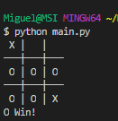

# Totito - Python

El tres en línea, también conocido como Ceros y Cruces, tres en raya (España, Ecuador y Bolivia), Michi (en Perú), Triqui (en Colombia), Cuadritos, juego del gato, Gato (en Chile, Costa Rica y México), Tatetí (en Argentina, Paraguay y Uruguay), Totito (en Guatemala), Triqui traka, Equis Cero, Tic-Tac-Toe (en Estados Unidos), o la vieja (en Venezuela), es un juego de lápiz y papel entre dos jugadores: O y X, que marcan los espacios de un tablero de 3×3 alternadamente.

# Random player - Demo

